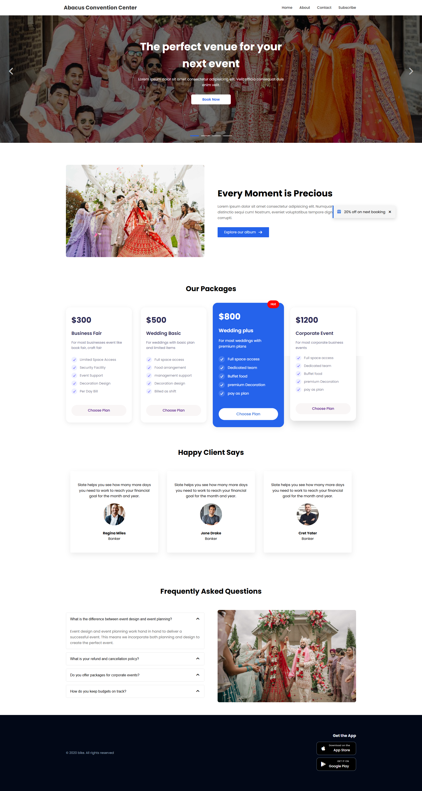
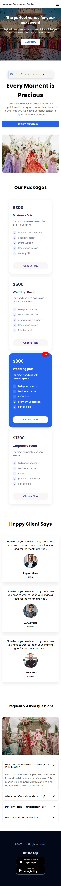

# Abacus Convention Center Website

A modern and responsive event venue website built using **HTML, CSS, and JavaScript**.  
This project represents a professional landing page for a convention center where users can explore event packages, view albums, read client reviews, and find answers to common questions.

---

## 🌐 Live Demo

🔗 **Live Website:**  
[Live Link](https://abacusconventationcenter.netlify.app/)

---

## 📸 Screenshots

### 🖥 Desktop View


### 📱 Mobile View


---

## 🚀 Features

- Responsive Navigation Bar
- Mobile Menu Toggle
- Hero Image Slider
- Event Packages Pricing Cards
- Album Showcase Section
- Special Offer Popup
- Client Reviews Section
- FAQ Accordion
- Fully Responsive Layout
- Modern UI Design

---

## 🛠️ Technologies Used

- **HTML5**
- **CSS3**
- **JavaScript (Vanilla JS)**
- **Font Awesome**
- **Google Fonts**

---

## 📂 Project Structure

```
project-folder
│
├── index.html
├── style.css
├── script.js
│
├── screenshots
│   ├── webview.png
│   └── mobileview.png
│
└── images
    ├── image-1.jpg
    ├── image-2.jpg
    ├── image-3.jpg
    ├── image-4.jpg
    ├── Album.jpg
    ├── client1.jpg
    ├── client2.jpg
    ├── client3.jpg
    └── faqimage.jpg
```

---

## ⚙️ How to Run the Project

1. Clone the repository

```
git clone https://github.com/yourusername/your-repository-name.git
```

2. Open the project folder

3. Run the project by opening

```
index.html
```

in your browser.

---

## 🎨 Website Sections

- Navigation Bar
- Hero Slider
- Album Section
- Event Packages
- Client Testimonials
- FAQ Section
- Footer

---

## 📱 Responsive Design

The website is fully responsive and optimized for:

- Desktop
- Tablet
- Mobile Devices

---

## ✨ Future Improvements

- Booking Form Integration
- Backend Reservation System
- Gallery Page
- Scroll Animations
- Event Management System

---

## 👨‍💻 Author

Developed by **Badrun Nahar Luna**

GitHub: https://github.com/naharluna

---

## 📄 License

This project is open-source and available under the **MIT License**.
